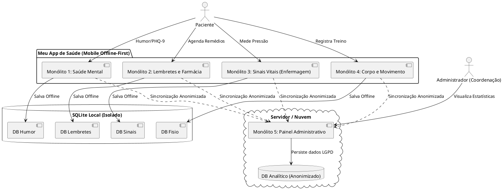
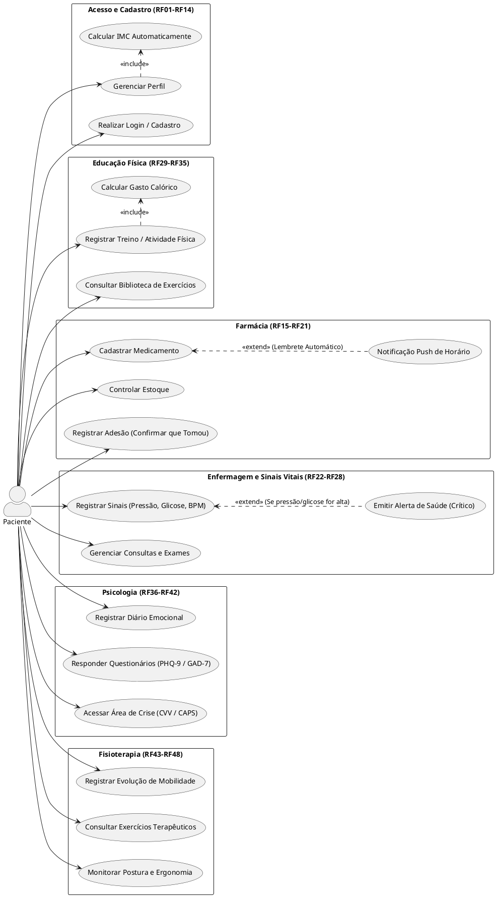

# Códigos PlantUML (Geração de Gráficos UML)

Abaixo estão os códigos em "Plain Text" (PlantUML) para você gerar gráficos UML que **fazem muito mais sentido** com a arquitetura real de vocês (os 5 monólitos e as funcionalidades que vocês efetivamente construíram).

Você pode copiar os blocos de código abaixo e colar no site **[PlantText](https://www.planttext.com/)** ou **[PlantUML Web](http://www.plantuml.com/plantuml/uml/)** para gerar as imagens e baixar.

---

## 1. Diagrama de Componentes (A Arquitetura dos 5 Monólitos)
Esse diagrama prova como o App funciona offline (com SQLite local) e manda os dados anonimizados para a nuvem.

---

## 2. Diagrama de Casos de Uso Completo (Visão Geral de Todos os Requisitos)
Este diagrama une todas as áreas da saúde que vocês levantaram nos requisitos (Acesso, Farmácia, Enfermagem, Ed. Física, Psicologia e Fisioterapia) em uma visão única e massiva.

